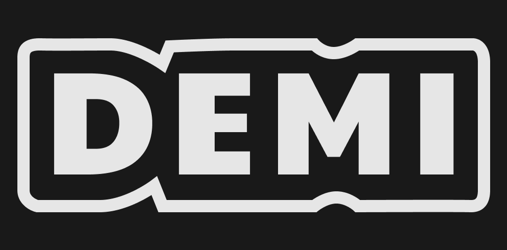

> ⚠️ `git checkout deadline` to get the status add submission deadline\
> ℹ️ `git log --oneline` to see the changes\
> ℹ️ Sunday: Current State of DemiThree
> [Video Version](https://youtu.be/vqR1VACYB5c)
> [Written Version](https://github.com/FrankBevr/Demi/blob/main/packages/docs/04-Notes/TestingWorkflow.md)

<h3 align="center">Demi</h3>
  

  Incentivesed Data Minesation
         
    <a href="https://youtu.be/H3LFmUR0u3U">Youtube</a>
    ·
    <a href="https://github.com/FrankBevr/Demi">Code</a>
  

### Screenshot

### Summary

[HackMD - Software Design](https://hackmd.io/BdFCoveBRR6QoHFQELCR0w)

Our goal was to build an MVP for an incentivesed Protocoll build on ink.\
_Inspired by
[Bittensor Network](https://docs.bittensor.com/?ref=parachains-info)_

> Incentivesed Protocoll:
>
> 1. User submit tasks and pays coins: f.e. "Create Data for XXX"
> 2. AI Node takes task from contract, does jobs, send result to contract
> 3. Validator takes result from contract, rates result, sends rated result to
   > contract
> 4. User see's results with ratings, picks result.
> 5. Best Ai node gets money

We build it via an iterative approach.\
We encountered bugs and erros, so we went even simpler.\
We build an DebugUI for greeter Smart Contract.\
We build demi one with an DebugUI\
We build demi two with an DebuguI\
We didn't build demithree with an Debug UI\
We didn't build simple UI for demithree

We achieved the following:

- Build a
  [Figma Design Sheet](https://github.com/FrankBevr/Demi/blob/main/packages/uiux/DesignSystem-Demi-Figma.pdf)
- Build
  [demione](https://github.com/FrankBevr/Demi/blob/main/packages/contracts/src/demione/lib.rs)
  and
  [demitwo](https://github.com/FrankBevr/Demi/tree/main/packages/contracts/src/demitwo)
- Intergerate [Leva - Debug UI](https://github.com/pmndrs/leva) for ink! Smart
  Contracts in the Frontend

**Things of value:**:

- How to write a Debug UI for ink Smart Contracts

Notes:

- Doings are documented in an
  [Organisation.org](https://raw.githubusercontent.com/FrankBevr/Demi/main/packages/docs/Organisation.org)
  File

### Quickstart

Terminal Contracts

- `npm i`
- `cd packages/contracts`
- `npm run build`
- `npm run node`
- `npm run script 01-greeter`
- `npm run script 02-demione`
- `npm run script 03-demitwo`

Terminal Frontend

- `cd packages/frontend`
- `npm run dev`
- `cat ./packages/frontend/src/app/page.tsx`

## Team

| Name          | Discord     | Telegram   | E-mail                        |
| :------------ | :---------- | :--------- | :---------------------------- |
| Frank Dierolf | frankbevr   | @frankbevr | `frank_dierolf@web.de`        |
| Botond Kovacs | -           | -          | `botondjanoskovacs@gmail.com` |
| Saro Posa     | babes_papes | -          | `-`                           |
